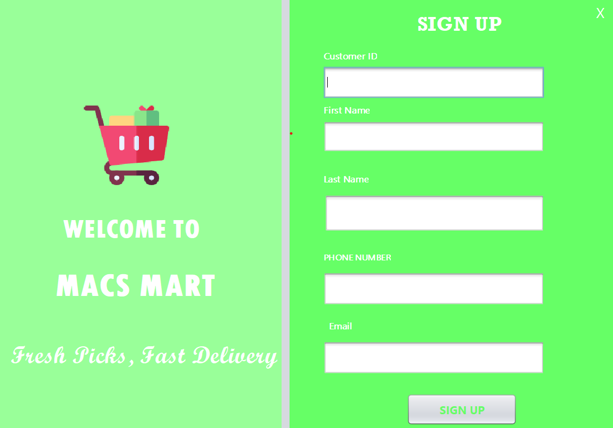

# E-Commerce Management System with Database



*A Java-based console application integrated with a MySQL database for efficient e-commerce management.*

---

## Overview
The **E-Commerce Management System (MACS Mart)** is designed to streamline the online shopping experience. It enables customers to browse products, manage their shopping cart, and complete secure transactions. This system ensures seamless shopping while optimizing business operations for better efficiency.

---

## Features
- **User Registration & Management**: Customers can register and manage their profiles.
- **Product Management**: Categorized products including Groceries, Fashion, Electricals, and Stationery.
- **Shopping Cart Functionality**: Add, edit, or remove items in the cart.
- **Order & Payment Processing**: Multiple payment methods with real-time status updates.
- **Product Search & Browsing**: Search by name or category.

---

## Database Setup
### Importing the `macs_mart` Database
This repository includes the exported SQL file (`macs_mart.sql`) for database setup.

#### **Method 1: Using MySQL Workbench**
1. **Open MySQL Workbench** and connect to your server.
2. **Create a new database:**
   ```sql
   CREATE DATABASE macs_mart;
   ```
3. **Import the SQL file:**
   - Navigate to **Server > Data Import**.
   - Select **Import from Self-Contained File** and choose `macs_mart.sql`.
   - Select `macs_mart` as the target database and start the import process.

#### **Method 2: Using Command Line**
1. Open the terminal or Command Prompt.
2. Execute the following command:
   ```bash
   mysql -u username -p macs_mart < /path/to/macs_mart.sql
   ```
   Replace `username` with your MySQL username and `/path/to/macs_mart.sql` with the actual file path.

---

## Software Requirements
- **Apache NetBeans** - Java development IDE.
- **Java Swing** - GUI framework for desktop applications.
- **MySQL** - Database for storing e-commerce data.
- **JDBC** - Java API for MySQL database connectivity.

---

## System Functionalities
### **1. Customer Management**
- User registration, login, and profile updates.

### **2. Product Management**
- Manage categorized product listings and update stock levels.

### **3. Shopping Cart**
- Add, modify, or remove items before checkout.

### **4. Order Processing & Payment**
- Secure transactions with multiple payment options.

### **5. Product Search & Filtering**
- Search products by name and category for a seamless experience.

---

## Database Structure
The system consists of the following key tables:
1. **Product Table** - Stores product details.
2. **Category Table** - Stores product categories.
3. **Customer Table** - Stores customer information.
4. **Cart Table** - Tracks cart sessions.
5. **Cart Item Table** - Stores items in the shopping cart.
6. **Payment Table** - Manages order transactions.

---

## Use Case Scenarios
1. **User Registration** - A new customer signs up and logs in.
2. **Adding Items to Cart** - Customers browse and add products to the cart.
3. **Checkout & Payment** - Customers finalize orders and make payments.
4. **Product Search** - Customers search for items using filters.

---

## Conclusion
The **E-Commerce Management System (MACS Mart)** offers an efficient online shopping solution with user-friendly navigation and secure transactions. Built with **Java Swing, MySQL, and JDBC**, it provides a comprehensive platform for both customers and businesses.

This system not only enhances user convenience but also streamlines business operations for better efficiency in managing an e-commerce store.

---

### 📌 Repository Link
[GitHub Repository](https://github.com/SnehalMeshram09/MACS_Mart)

